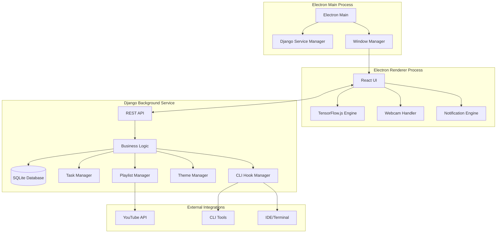

# Design Document

## Overview

SideEye is a hybrid desktop application that combines real-time biometric monitoring with intelligent workspace automation. The system uses a multi-layered architecture with Electron providing the cross-platform desktop interface, Django serving as a local background service for business logic, and TensorFlow.js handling privacy-focused machine learning inference directly in the browser context.

The application operates entirely offline to ensure user privacy, with all biometric data processing happening locally. The system learns user preferences through explicit feedback and implicit behavior patterns to provide increasingly personalized workspace automation.

## Architecture

### High-Level Architecture



### Component Architecture

The system follows a microservice-like pattern with clear separation of concerns:

1. **Frontend Layer (Electron Renderer)**: Handles UI, real-time ML inference, and user interactions
2. **Service Layer (Django)**: Manages business logic, data persistence, and external integrations
3. **Integration Layer**: Interfaces with external tools and services

## Components and Interfaces

### Electron Frontend Components

#### TensorFlow.js Emotion Detection Engine
- **Purpose**: Real-time facial emotion and posture analysis
- **Models**: 
  - Face-api.js for facial landmark detection and emotion classification
  - PoseNet for posture analysis
  - Custom blink detection algorithm using eye aspect ratio
- **Input**: Webcam video stream
- **Output**: Emotion probabilities, posture metrics, blink rate data
- **Performance**: Target 10 FPS processing to balance accuracy with CPU usage

#### React UI Components
- **Dashboard**: Real-time emotion/energy display and system status
- **Settings Panel**: User preference configuration for music, themes, and notifications
- **Feedback Modal**: Collects user feedback on AI suggestions
- **Task List**: Displays energy-sorted tasks with drag-and-drop reordering
- **Notification Center**: Shows system alerts and wellness reminders

#### Webcam Handler
- **Purpose**: Manages camera access and video stream processing
- **Features**: Privacy controls, stream quality adjustment, fallback handling
- **Security**: Local processing only, no stream recording or transmission

### Django Backend Components

#### REST API Layer
```python
# Key API endpoints
/api/emotions/          # POST emotion data, GET emotion history
/api/tasks/             # CRUD operations for task management
/api/preferences/       # User preference management
/api/playlists/         # Music recommendation and playlist management
/api/themes/            # Theme management and CLI hook execution
/api/notifications/     # Notification scheduling and delivery
/api/feedback/          # User feedback collection and learning
```

#### Business Logic Services

**Emotion Analysis Service**
- Processes raw emotion data from frontend
- Calculates energy levels and mood trends
- Triggers appropriate system responses
- Manages notification rate limiting

**Task Management Service**
- Sorts tasks based on current energy levels and complexity
- Learns task-energy correlations from user behavior
- Provides task recommendations and scheduling

**Playlist Management Service**
- Integrates with YouTube Data API v3 for playlist discovery
- Maintains user music preferences and genre mappings
- Implements recommendation algorithms based on emotion-music correlations

**Theme Management Service**
- Manages color palette and theme configurations
- Executes CLI hooks for external tool integration
- Handles theme switching logic and fallback mechanisms

**Learning Engine**
- Processes user feedback to improve recommendations
- Maintains preference models for music and themes
- Implements reinforcement learning for suggestion improvement

### Data Models

#### User Preferences Model
```python
class UserPreferences(models.Model):
    # Music preferences
    preferred_genres = models.JSONField(default=list)
    music_energy_mappings = models.JSONField(default=dict)
    
    # Theme preferences  
    preferred_color_palettes = models.JSONField(default=list)
    theme_emotion_mappings = models.JSONField(default=dict)
    
    # Notification settings
    notification_frequency = models.IntegerField(default=5)  # minutes
    wellness_reminder_interval = models.IntegerField(default=60)  # minutes
    notification_tone = models.CharField(max_length=20, default='balanced')
```

#### Emotion Data Model
```python
class EmotionReading(models.Model):
    timestamp = models.DateTimeField(auto_now_add=True)
    emotions = models.JSONField()  # {happy: 0.8, sad: 0.1, ...}
    energy_level = models.FloatField()  # 0.0 to 1.0
    posture_score = models.FloatField()  # 0.0 to 1.0
    blink_rate = models.FloatField()  # blinks per minute
    confidence = models.FloatField()  # detection confidence
```

#### Feedback Model
```python
class UserFeedback(models.Model):
    timestamp = models.DateTimeField(auto_now_add=True)
    suggestion_type = models.CharField(max_length=20)  # 'music', 'theme'
    emotion_context = models.JSONField()
    suggestion_data = models.JSONField()
    user_response = models.CharField(max_length=20)  # 'accepted', 'rejected'
    alternative_preference = models.JSONField(null=True)
```

## Error Handling

### Frontend Error Handling
- **Camera Access Denied**: Graceful fallback to manual mode with user controls
- **TensorFlow.js Model Loading Failure**: Retry mechanism with offline model caching
- **API Communication Errors**: Queue operations for retry when service is restored

### Backend Error Handling
- **Django Service Crashes**: Automatic restart with exponential backoff
- **External API Failures**: Cached fallback data and graceful degradation
- **CLI Hook Failures**: Error logging with user notification and fallback themes

### Data Integrity
- **Emotion Data Validation**: Confidence thresholds and outlier detection
- **Preference Corruption**: Backup and restore mechanisms for user settings
- **Database Errors**: SQLite WAL mode for concurrent access and automatic recovery

## Testing Strategy

### Unit Testing
- **Frontend**: Jest for React components, TensorFlow.js model testing with mock data
- **Backend**: Django TestCase for API endpoints and business logic
- **Integration**: Electron spectron for end-to-end desktop app testing

### Performance Testing
- **ML Inference**: Benchmark emotion detection latency and CPU usage
- **Memory Usage**: Monitor for memory leaks in long-running sessions
- **API Response Times**: Ensure sub-100ms response times for real-time features

### Privacy Testing
- **Data Flow Auditing**: Verify no biometric data leaves the local system
- **Network Traffic Analysis**: Monitor for unexpected external communications
- **Data Persistence**: Validate local-only storage and secure deletion

### User Experience Testing
- **Feedback Loop Testing**: Verify learning system improves recommendations over time
- **Notification Rate Limiting**: Confirm adherence to frequency constraints
- **Accessibility**: Screen reader compatibility and keyboard navigation

## Security Considerations

### Privacy Protection
- All biometric processing occurs locally using TensorFlow.js
- No cloud-based ML services or external emotion analysis APIs
- User data stored only in local SQLite database with optional encryption

### External Integration Security
- YouTube API calls limited to public playlist data only
- CLI hook execution with user-configurable command validation
- Sandboxed execution environment for external tool integration

### Data Protection
- Automatic data retention policies with configurable cleanup
- Secure deletion options for complete data removal
- Export functionality for user data portability

## Performance Optimization

### Real-time Processing
- Optimized TensorFlow.js model loading with WebGL acceleration
- Frame skipping during high CPU usage to maintain responsiveness
- Efficient emotion data batching to reduce API calls

### Resource Management
- Lazy loading of ML models to reduce startup time
- Background service resource monitoring and automatic scaling
- Intelligent caching of theme configurations and playlist data

### Scalability
- Modular plugin architecture for adding new integrations
- Configurable processing intervals based on system capabilities
- Graceful degradation on lower-powered devices